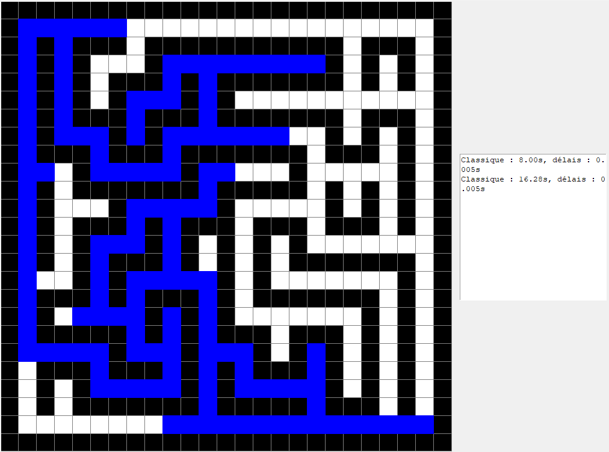
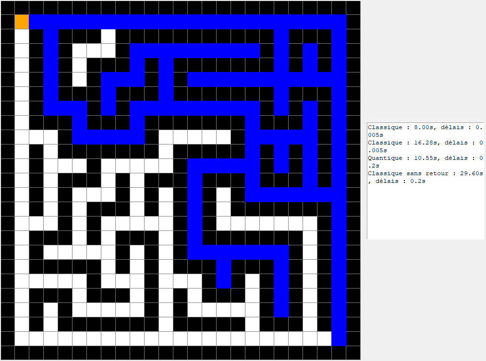
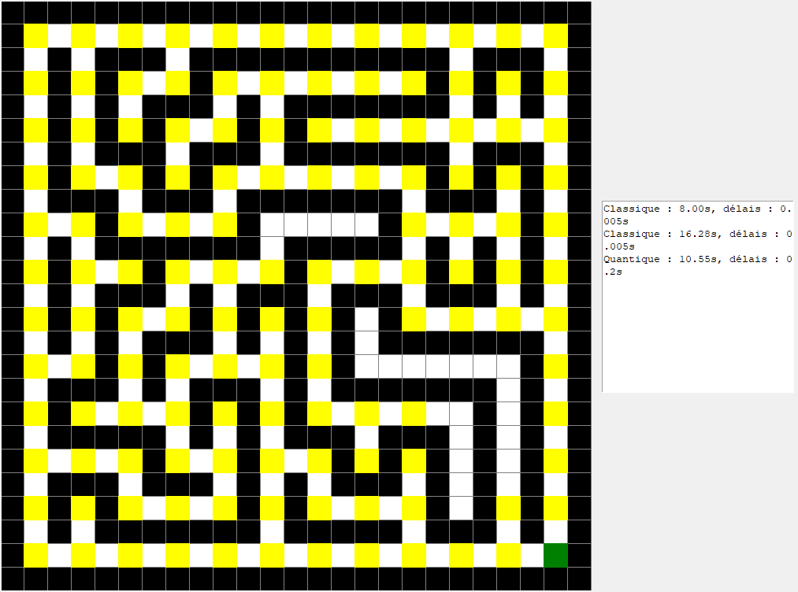
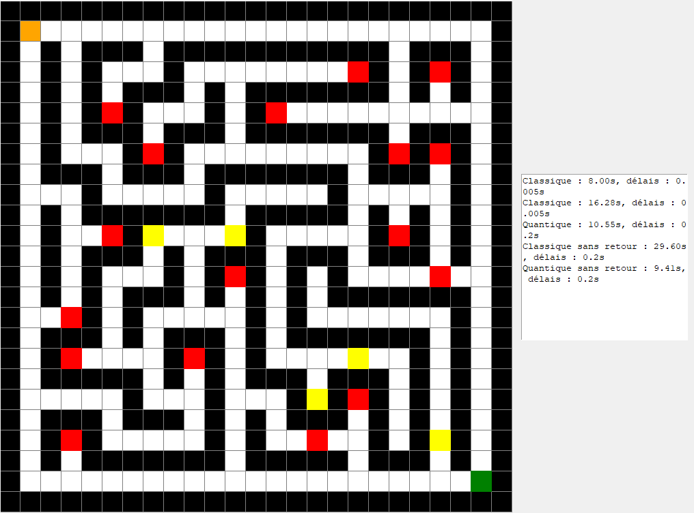

# Résolution de Labyrinthe avec Marche Aléatoire Classique et Quantique

Ce projet propose différentes approches pour résoudre un labyrinthe en utilisant des algorithmes de marche aléatoire. Les méthodes implémentées incluent :

1. **Marche aléatoire classique**.
2. **Marche aléatoire classique sans retour**.
3. **Marche aléatoire quantique**.
4. **Marche aléatoire quantique sans retour**.

Chaque méthode est visualisée graphiquement pour démontrer son comportement et son efficacité.

---

## 📂 Structure du Projet

- **maze_solving.py** : Code Python contenant les implémentations des quatre méthodes.
- **maze_solving_classique.png** : Résultat de la marche aléatoire classique.
- **maze_solving_classique_sans_retour.png** : Résultat de la marche aléatoire classique sans retour.
- **maze_solving_quantique.png** : Résultat de la marche aléatoire quantique.
- **maze_solving_quantique_sans_retour.png** : Résultat de la marche aléatoire quantique sans retour.

---

## 🔧 Prérequis

- Python 3.x
- Bibliothèques requises : `numpy`, `tkinter` et `time`.

---

## 🚀 Exécution du Projet

1. Clonez ce repository :
```bash
   git clone https://github.com/AntoineBuffandeau/Maze_Solving_Random_Walk.git
   cd Maze_Solving_Random_Walk
```
2. Lancez le programme Python
```bash
   python maze_solving.py
```

## 📊 Visualisation des Résultats

### Marche Aléatoire Classique



### Marche Aléatoire Classique Sans Retour



### Marche Aléatoire Quantique



### Marche Aléatoire Quantique Sans Retour

